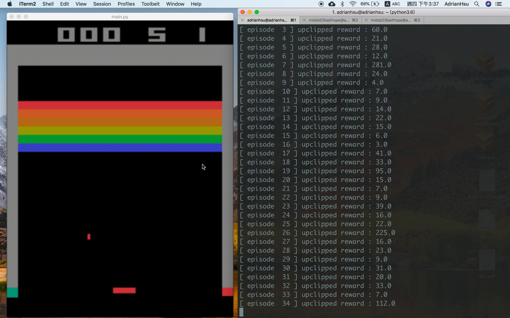
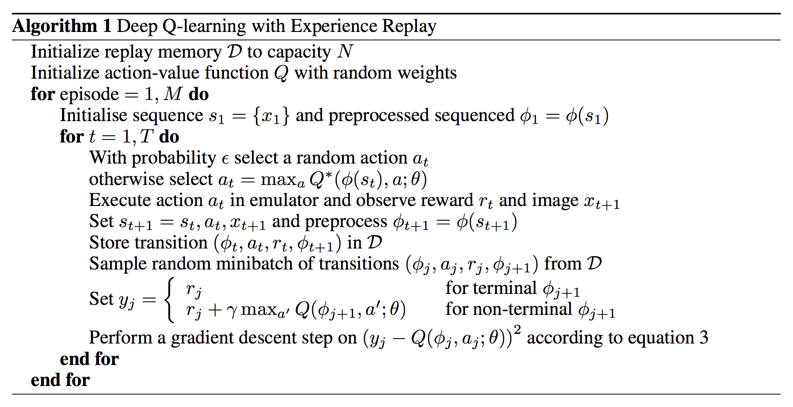
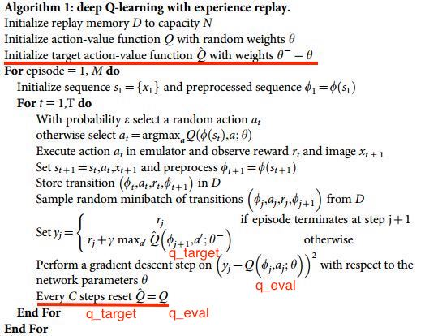
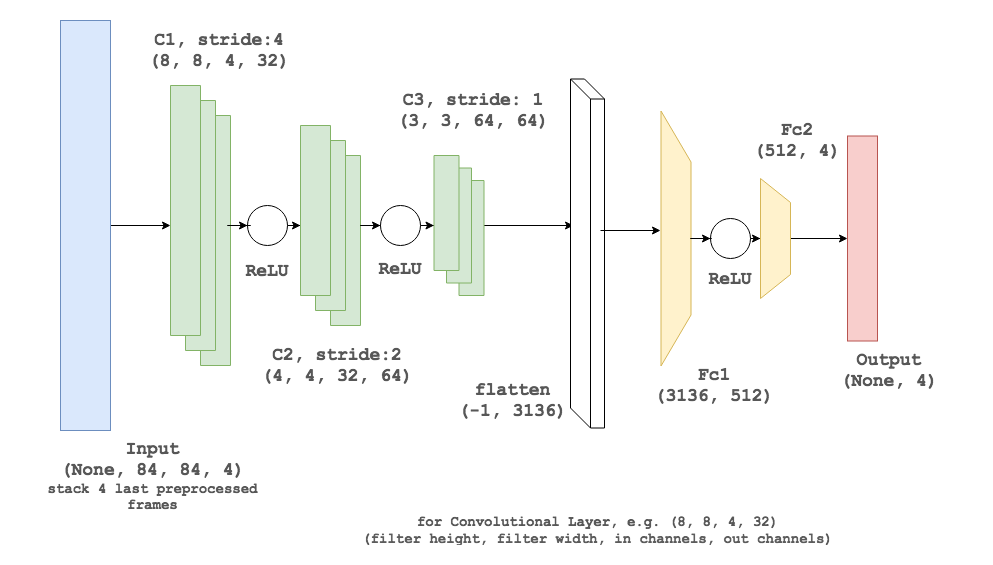
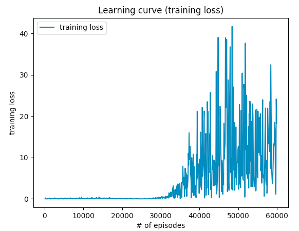
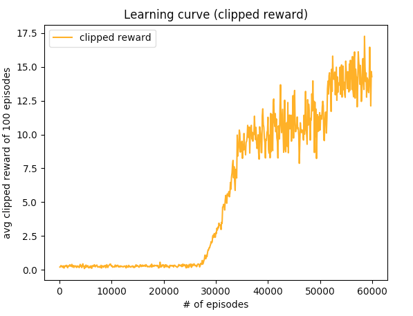
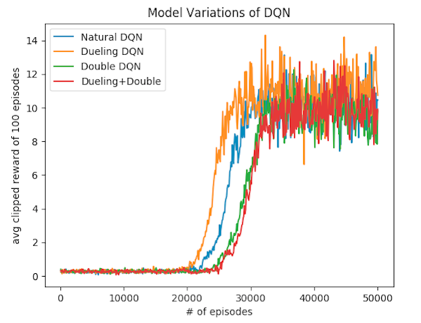
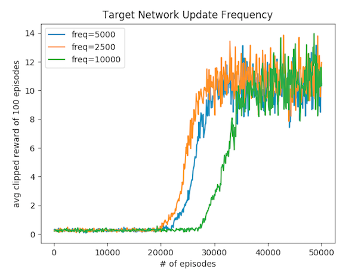
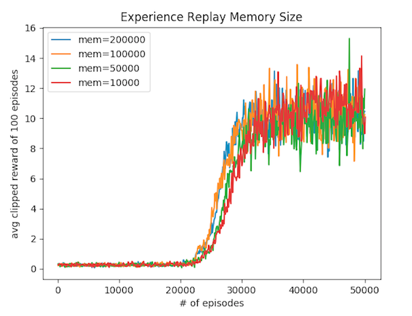

# breakout-Deep-Q-Network
> 🏃 [Reinforcement Learning] tensorflow implementation of Deep Q Network (DQN),  Dueling DQN and Double DQN performed on Atari Breakout Game
>
> 

<p align=center><a target="_blank" href="https://opensource.org/licenses/MIT" title="License: MIT"></a><a target="_blank" href="http://makeapullrequest.com" title="PRs Welcome"></a></p>  




## Installation

Type the following command to install OpenAI Gym Atari environment.

`$ pip3 install opencv-python gym gym[atari]`

Please refer to [OpenAI's page](https://github.com/openai/gym) if you have any problem while installing.

## How-to

Please don't revise `test.py`, `environment.py`, `agent_dir/agent.py`

training DQN:

- `$ python3 main.py --train_dqn`

testing DQN:

- `$ python3 test.py --test_dqn`

Note: the environment also provides interface for game **pong**, but I didn't implement the model yet.


## Implementation

### Algorithm: deep Q-learning with experience replay



Reference: "Playing Atari with Deep Reinforcement Learning", p.5, [Link](https://www.cs.toronto.edu/~vmnih/docs/dqn.pdf)

This is the simplest DQN with no decoration, which is not enough to train a great DQN model. So we have to add some decorations...




we **replace the params of target network with current network's.** It's important that both model have totally identical NN structure, and what we have to do is to **assign** the value of each parameters in current network into target network. This will benefit us since that we temporarily **freeze** those parameters in q_target.

* `q_target`: update by `tf.assign`, from the q_eval. this will not be directly trained, and the update frequency is relatively slow (5000 steps/per update) **We will compute y_j using target network Q rather than current network.**
* `q_eval`: update very frequently (4 steps/per update)

### Initialization

I use the **cyclic buffer** to act as the replay memory D, and my implementation  follows the pytorch official DQN tutorial [Link](https://pytorch.org/tutorials/intermediate/reinforcement_q_learning.html#replay-memory). Initially I use data structure **deque** to implement this memory, but the random sampling performs really bad. Please check `agent_dqn.py` #L109.

The memory capacity is a huge problem since that it's recommended by the original author that the memory size should be **1,000,000**. (however I use 200,000 instead).  To store a million of those, that’s about 9GB in frames, all of it in RAM!!

I followed the tutorial here [Link](https://becominghuman.ai/lets-build-an-atari-ai-part-1-dqn-df57e8ff3b26) . We have to store the `(state, action, reward, next_state, done)` into the buffer, and it costs a lot to store in format `float32`. 

Therefore I stored the `action`, `reward` in the uint8 type, and also store the frames using the `np.uint8` type and convert them to floats in the [0, 1] range at the last moment. Because uint8 is the smallest type available, so it can save about 2.5x RAM memory efficiently. 

### Action Space

[Link](https://github.com/openai/gym/issues/401)

* Atari Breakout originally has following 6 action space`['NOOP', 'FIRE', 'RIGHT', 'LEFT', 'RIGHTFIRE', 'LEFTFIRE']`

* The ball in the Breakout atari game does not appear until one of `['FIRE', 'RIGHTFIRE', 'LEFTFIRE']` actions is executed.
* However, during training we don't need the last two, so we use action space `['NOOP', 'FIRE', 'RIGHT', 'LEFT']`

### Main Loop

```
for episode in range(NUM_EPOISODES):

	obs = self.env.reset()
	for s in range(MAX_STEPS):
		action = self.make_action(obs)
		obs_, reward, done, _ = self.env.step(action)
		self.storeTransition(obs, action, reward, obs_, done)
		if step % 4 == 0:
			self.learn()
		obs = obs_
		if done:
			break
```

### Explanation

We can refer the pseudo code to the written algorithm:

> With probability \epsilon, select a random action $a_t$
>
> otherwise select $a_t$ = max_a Q* (φ(st), a; θ)

```
# in make_action()
	
	# since that it's an iterative process, we have to get q_value first (which is already initialized)
    q_value = self.sess.run(self.q_eval, feed_dict={self.s: state})[0]
    
    ...
    
	# if/else statement 
	if random.random() <= self.epsilon:
      action = random.randrange(self.n_actions)
    else:
      action = np.argmax(q_value)
```

> Execute action at in emulator, and observe reward $r_t$ and image $x_{t+1}$
>
> Set s_{t+1}  = s_t, a_t, x_{t+1} and preprocess φ_{t+1} = φ(st+1)

```
# in main loop()
	obs_, reward, done, _ = self.env.step(action)
	# r_t: reward
	# image x_{t+1} : obs_ 
```

> Store transition (φt, at, rt, φt+1) in D, Set st+1 = st, at, xt+1 

```
# in storeTransition()
	self.memory.push(s, int(action), int(reward), s_, done)

```

> preprocess φt+1 = φ(st+1)

```
# in learn()
q_batch = self.sess.run(self.q_target, 
        feed_dict={self.s_: next_state_batch})
```

> Sample random minibatch of transition from D
>
> Set y_j for terminal/non-terminal

```
# calculate target Q first
q_batch = self.sess.run(self.q_target,  
        feed_dict={self.s_: next_state_batch})
for i in range(self.batch_size):
    if done: # terminal
      y_batch.append(reward_batch[i])
    else: # non-terminal
      y = reward_batch[i] + self.gamma * np.max(q_batch[i])
      y_batch.append(y)
```

> Perform the gradient descent step according to equation 3

```
    self.q_action = tf.reduce_sum(tf.multiply(self.q_eval, 	    
self.action_input), axis=1)
    self.loss = tf.reduce_mean(tf.square(self.y_input - self.q_action))
```

### freeze `q_target`

We can use `tf.get_collection()` and `tf.variable_scope` combined with `tf.assign()` to achieve this. (according to [MorvanZhou's RL tutorials](https://morvanzhou.github.io/tutorials/machine-learning/reinforcement-learning/) ) 

```
    self.t_params = tf.get_collection(tf.GraphKeys.GLOBAL_VARIABLES, scope='target_net')
    self.e_params = tf.get_collection(tf.GraphKeys.GLOBAL_VARIABLES, scope='eval_net')

    self.replace_target_op = [tf.assign(t, e) for t, e in zip(self.t_params, self.e_params)] 
```

This will benefit us since that we temporarily **freeze** those parameters in q_target. 


## Neural Network Structure



In short, I followed the same structure as the original work **"Human-Level Control Through Deep Reinforcement Learning", published on Nature**. That is, 3 conv layer + activation function (ReLU) + 2 fc layer.

In tensorflow, `None` are usually replaced with the batch size.

## Hyperparameters

* Batch size: 32
* Replay memory size: 200000
  * (SGD updates are sampled from this number of most recent frames)
* Update target network frequency: 5000 (steps) 
* Update current network frequency: 4 (steps)
* Gamma for reward decay (discount dactor) : 0.99
* OBSERVE stage: < 50000 (steps)
* EXPLORE stage: 50000 to 1000000 (steps)
* TRAIN stage: > 1000000 (steps)
* Number of episodes: 100000
* Max number of steps in each episode: 10000
* Action repeat: 4
  * repeact each action selected by agents this many times.

#### Optimizer: `tf.RMSPropOptimizer`

* initial learning rate: 0.00025
* decay rate: 0.99
* Gradient Momentum: 0
* Epsilon: 1e-6
* gradient clipping:  `(-1, 1)`

### e-greedy exploration

* initial exploration: 1.0
* final exploration: 0.1
* final exploration frame: 1000000
  * the number of frames over which the initial `epsilon = 1.0` is linearly annealed to its final value `0.1`
* replay start size: 50000
  * an uniform random policy is run for this number of frames in OBSERVE stage. **( because agent is weak at start )**
  * this experience (replay) memory is used to populate the **replay memory**.


## Improvements of DQN

* Dueling DQN
* Double DQN

You can access this model structure by adding arguments like `--dueling_dqn=1`, `--double_dqn=1`


#### Dueling DQN

```python
self.V = ...
self.A = ...

out = self.V + (self.A - tf.reduce_mean(self.A, axis=1, keep_dims=True))
```

#### Double DQN

```
q_batch_now = ...
q_batch = ...

for i in range(self.batch_size):
    double_q = q_batch[i][np.argmax(q_batch_now[i])]
    y = reward_batch[i] + self.gamma * double_q
```


#### **the learning curve**

| Training Loss     | Training clipped reward |
| ----------------- | ----------------------- |
|  |      |

### Experiments


| Exp 1. Model Variations                                      | Exp 2. Target Network Update Frequency                       |
| ------------------------------------------------------------ | ------------------------------------------------------------ |
|                                            |                                    |
| 我做了四種 models，結果發現 dueling DQN 能夠最快開始收斂、至於 Double DQN 的效果卻不太顯著、甚至還比 natural DQN 差，然後 Dueling + Double 則是最差的。我猜想可能需要調整參數、或是 train 得還不夠久。但也可能因為 Natural DQN 在 breakout 表現很好、所以其他 model 進步空間不大。 | 我測試了 target model freeze 的時間長度，也就是每次 q_eval 用 `tf.assign()` 給 q_target 的 steps 數的間隔。結果是如果 frequency 比較高的話、他能比較快的 train 起來、但事相對的 train 的速度會被拖慢、至於 train 出來的分數好像不多，不會因為 frequency 而影響。我也有做 20000 但效果不好就沒有放。 |
| **Exp 3. Experience Replay Memory Size**                     | **Exp 4. Gamma $\gamma$ (Discount Factor) value**            |
|                                              |                                            |
| 因為原本 paper 是寫說 memory size 要設為 1,000,000，所以我花很多時間處理 RAM 記憶體問題（傳進 buffer 用 uint8 存，除以 255，等到要算 y 時再轉回 float32）。但後來發現在 breakout 這個遊戲幾乎不影響，助教也說 10000 就能夠 train 到 reward = 30000。可能是要到後期才會看出 memory 的重要、或是 breakout 遊戲長度比其他 atari 遊戲長度短。 | DQN 的 Decay Factor 會明顯影響 train 起來的效果。如果 `y = reward_batch[i] + self.gamma * np.max(q_batch[i])` 這個 gamma 越大的話，就越能考慮未來、越看重估計的 Q 未來值，如果 gamma 太小就是看得不夠遠。結果發現實驗符合理論、 gamma 太小真的會 train 不起來、而 gamma 大一點，像是 paper 上面建議的 0.99 就能有很好的表現， |


### Reference

- [MorvanZhou's RL tutorials](https://morvanzhou.github.io/tutorials/machine-learning/reinforcement-learning/) 
- [floodsung/DQN-Atari-Tensorflow](https://github.com/floodsung/DQN-Atari-Tensorflow)
- "Human-Level Control Through Deep Reinforcement Learning". Nature, 518(7540):529–533, 02 2015. [Link](http://dx.doi.org/10.1038/nature14236)
- "Playing atari with deep reinforcement learning". Mnih, Volodymyr, Kavukcuoglu, Koray, Silver, David, Graves, Alex, Antonoglou, Ioannis, Wierstra, Daan, and Riedmiller, Martin. In NIPS Deep Learning Workshop. 2013. [Link](https://arxiv.org/abs/1312.5602)

